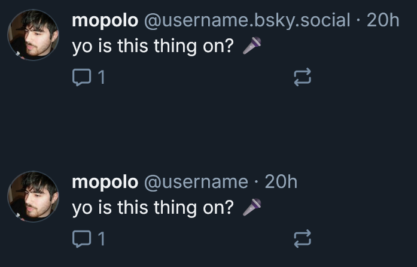

# BlueSky Handle Cleaner

A simple userscript that removes ".bsky.social" from handles on BlueSky websites while keeping all links functional.

## Install
1. Get a userscript manager (Tampermonkey, Violentmonkey, etc.)
2. Create new script and [paste this code](https://github.com/mopoIo/bluesky-handle-cleaner/raw/refs/heads/main/BlueSky%20Handle%20Cleaner-1.0.user.js) (sometimes by just clicking that link you'll be prompted to install it right away)
3. Save and enable

## What it does
- Makes "@username.bsky.social" display as just "@username"
- Works on all bsky.app subdomains
- Doesn't break any links or functionality

That's it! Enjoy a cleaner BlueSky experience.
